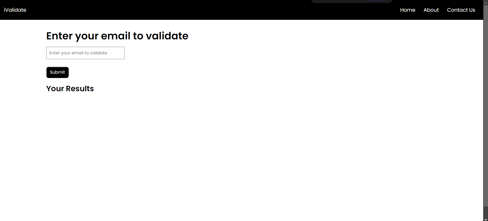
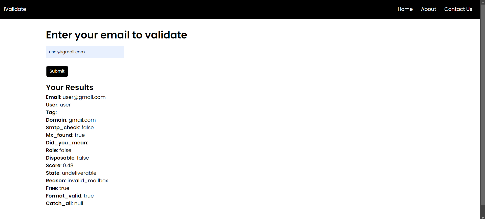

# Email Validator - HTML, CSS & JavaScript

This project is a simple web app to validate email addresses using HTML, CSS, JavaScript, and an external API.

## Features
- Validates an email address and displays detailed validation results.
- Uses an external API to fetch validation data, such as domain and formatting checks.

## How to Use
1. Open the `index.html` file in your browser.
2. Enter an email address in the input field.
3. Click the "Submit" button to validate the email.
4. View the validation details displayed below.

## Technology Stack
- **HTML**: For structuring the web page.
- **CSS**: For styling the app.
- **JavaScript**: For making API calls and displaying results.
- **API Used**: [EmailValidation.io Email Validation API](https://app.emailvalidation.io/email-validation)

## Screenshots



## Project Status
- This project is complete, but improvements (e.g., better UI or additional features) may be added in the future.


## Usage
1. Clone the repository:
   ```bash
   git clone https://github.com/Dhirajmn/html-css-js-projects/iValidate:-An-Email-Validator-App.git
